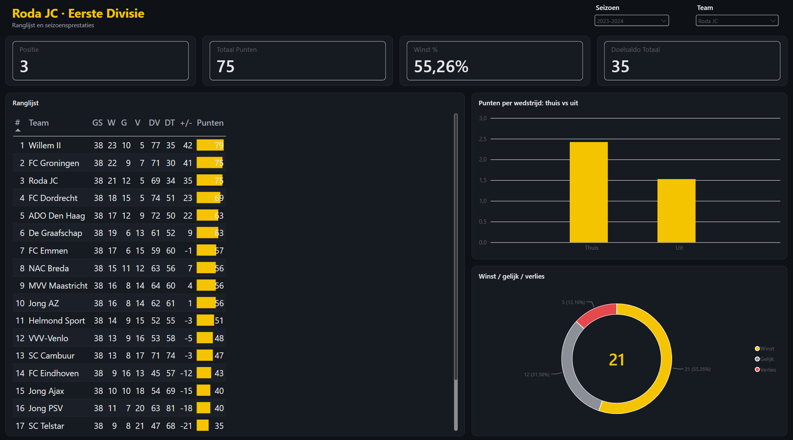
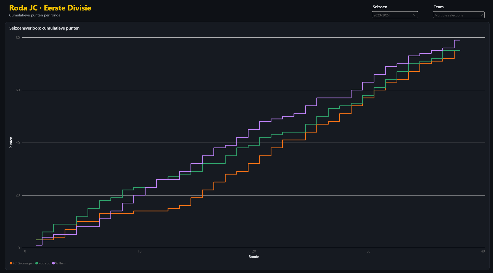

# Eerste Divisie – voetbalanalyse in Power BI

Power BI-dashboard over de Eerste Divisie in de seizoenen 2023-2024 en 2024-2025. Je kunt elk team selecteren en vergelijken. Alle wedstrijden komen uit een publieke API. De data wordt opgeschoond in Power Query, gemodelleerd als ster-schema en geanalyseerd met DAX.




## Wat laat het dashboard zien?

- **Ranglijst:** de eindstand per seizoen (W/G/V, doelpunten, doelsaldo, punten), berekend uit de losse wedstrijden. Bij gelijke punten beslist het doelsaldo.
- **KPI's per team:** positie, punten, winstpercentage en doelsaldo.
- **Thuis vs uit:** punten per wedstrijd thuis en uit.
- **Seizoensverloop:** cumulatieve punten per ronde, zodat je teams naast elkaar kunt zetten in de titel- of degradatiestrijd.

## Data

Bron: [TheSportsDB](https://www.thesportsdb.com/), gratis API, league id 4641.

`scripts/data.py` haalt de wedstrijden per ronde op (2 seizoenen × 38 rondes) en schrijft ze naar `data/wedstrijden/wedstrijden.csv`. De API heeft een rate limit, dus het script wacht 2 seconden per request.

```bash
uv run scripts/data.py
```

Eén wedstrijd (Willem II – NAC, 5-9-2023) stond dubbel in de API. Die wordt in Power Query verwijderd, zodat er 760 wedstrijden overblijven.

## Datamodel

Het brondata heeft één rij per wedstrijd, met een thuis- en een uitteam. Dat is onhandig om mee te rekenen, want een team staat dan in twee kolommen. Daarom maak ik in Power Query van elke wedstrijd **twee rijen**: één vanuit het thuisteam en één vanuit het uitteam. Die twee perspectieven worden onder elkaar gezet.

```
Teams (1) ──── (*) TeamWedstrijden (*) ──── (1) Datum
```

| Tabel | Type | Inhoud |
|---|---|---|
| `TeamWedstrijden` | fact | 1520 rijen: seizoen, ronde, datum, team, tegenstander, voor/tegen, thuis/uit, resultaat, punten |
| `Teams` | dimensie | 23 unieke teams |
| `Datum` | dimensie | kalender (DAX `CALENDAR`), gemarkeerd als date table |

Met dit model staat elk team altijd in één kolom. Daardoor blijven de measures simpel en filtert een team-slicer direct alles.

## DAX

Alle measures staan in de tabel `_Metingen`. De interessantste:

```dax
Positie =
IF(
    ISBLANK([Wedstrijden]),
    BLANK(),
    RANKX(ALL(Teams), [Totaal Punten] * 1000 + [Doelsaldo Totaal])
)
```
`ALL(Teams)` haalt het team-filter van de rij weg, zodat elk team tegen alle andere wordt gerangschikt. De `* 1000` zorgt ervoor dat punten altijd zwaarder wegen en het doelsaldo alleen bij gelijke punten beslist. Teams die in een seizoen niet meespeelden krijgen geen positie.

```dax
Seizoensverloop =
CALCULATE(
    [Totaal Punten],
    FILTER(
        ALL(TeamWedstrijden[Ronde]),
        TeamWedstrijden[Ronde] <= MAX(TeamWedstrijden[Ronde])
    )
)
```
Dit zijn de cumulatieve punten tot en met de ronde op de x-as.

Verder zijn er onder andere `Wedstrijden`, `Totaal Punten`, `Winst`/`Gelijk`/`Verlies` (via `CALCULATE`) en `Winst %`.

## Openen

Het rapport is opgeslagen als Power BI Project (`.pbip`), zodat het model (TMDL) en de visuals (PBIR/JSON) als tekst in git staan.

1. Voer `scripts/data.py` uit, of gebruik de meegeleverde CSV.
2. Open `roda_dashboard.pbip` in Power BI Desktop.
3. Pas zo nodig het pad naar de CSV aan in Power Query en klik op **Refresh**.

## Tools

Python (requests, pandas) · Power BI Desktop · Power Query (M) · DAX
